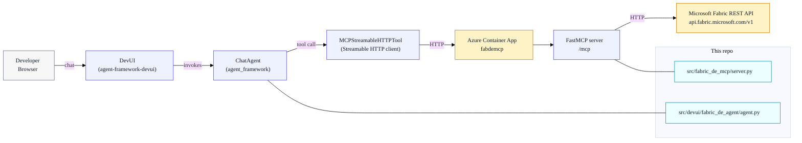
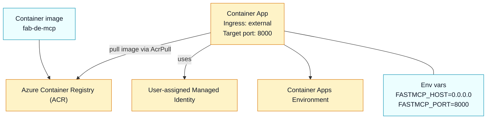

# Architecture

This repo has two distinct entry points:

1. **MCP Server (production purpose)**: `fabric_de_mcp` exposes MCP tools over Streamable HTTP.
2. **DevUI + Agent Framework (local testing UI)**: DevUI hosts a chat UI and an OpenAI-compatible API that talks to the MCP server via `MCPStreamableHTTPTool`.

## System context (DevUI → MCP → Fabric)

## Azure Container Apps deployment (high-level)

The infra template provisions:

- **ACR** for container images
- **User-assigned managed identity** (UAMI)
- **Container App Environment** + **Container App** with ingress on port `8000`

## Key modules

- `src/fabric_de_mcp/server.py`
  - MCP tool registration (`@app.tool()`)
  - Tool wrappers accept an optional `token` override
  - Runs Streamable HTTP transport
- `src/fabric_de_mcp/fabric/auth.py`
  - `DefaultAzureCredential()` token acquisition
- `src/fabric_de_mcp/fabric/api.py`
  - Fabric REST calls, retries, and request/response handling
- `src/devui/fabric_de_agent/agent.py`
  - DevUI-discoverable `agent = ChatAgent(...)` that connects to the MCP server
