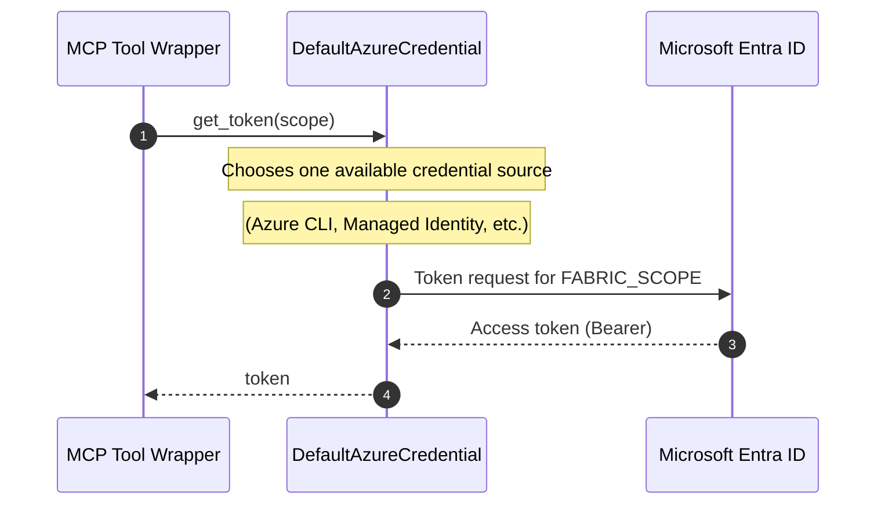
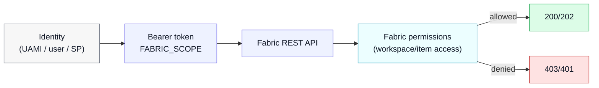

# Authentication & authorization

This repo uses **Azure Identity** to obtain bearer tokens for Fabric.

## Authentication flow

`src/fabric_de_mcp/fabric/auth.py` uses `DefaultAzureCredential()`.

## Authorization (what the token can do)

Authorization is ultimately enforced by **Fabric**.

## Important notes

- The MCP tool wrappers accept an optional `token` parameter. If provided, the server will use it.
- If `token` is omitted, the server will acquire one using `DefaultAzureCredential`.
- In Azure Container Apps, `DefaultAzureCredential` can use Managed Identity when configured.
