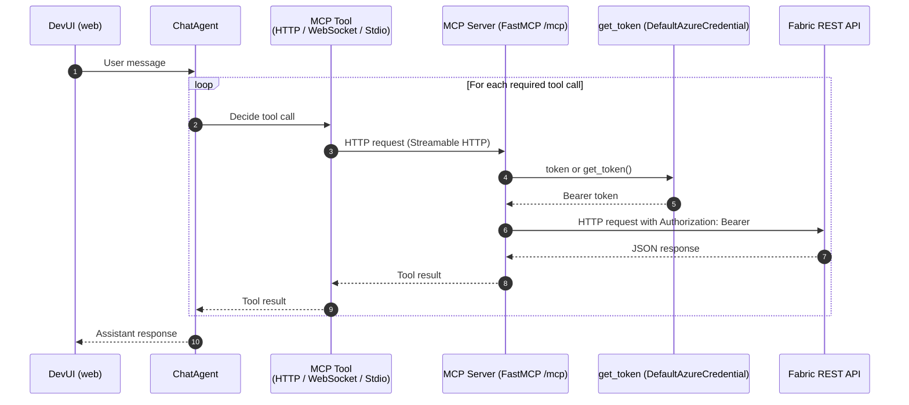
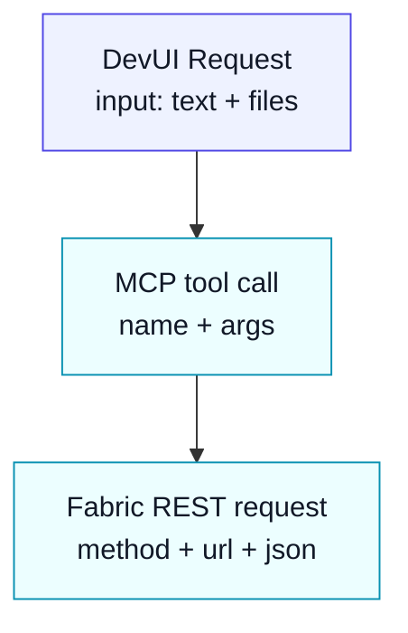

# DevUI + Agent Framework dataflow

This document explains the runtime dataflow when using DevUI to test the MCP server.

## Directory discovery structure

DevUI directory discovery expects each agent directory to export `agent` from its `__init__.py`.

This repo follows the sample structure:

```text
src/devui/
  fabric_de_agent/
    __init__.py      # exports: agent
    agent.py         # agent implementation
    .env.example
```

## End-to-end sequence (DevUI → MCP → Fabric)



## Request/response payload shape (conceptual)

At runtime, you should think of the payloads in three layers:

1. **DevUI conversation request** (OpenAI-compatible API)
2. **Tool invocation** (Agent Framework → MCP tool)
3. **Fabric REST call** (`requests` → `https://api.fabric.microsoft.com/v1/...`)



## Local vs Azure

- **Local**: `FABRIC_DE_MCP_SERVER_URL` can be `http://127.0.0.1:8000/mcp`.
- **Azure Container App**: `FABRIC_DE_MCP_SERVER_URL` should be `https://<containerapp-fqdn>/mcp`.
