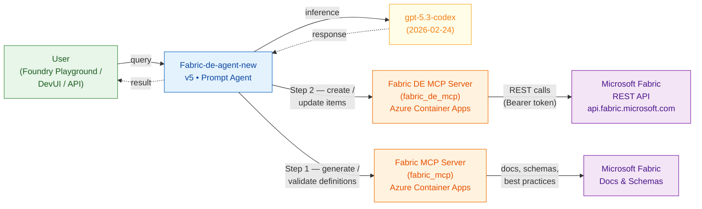
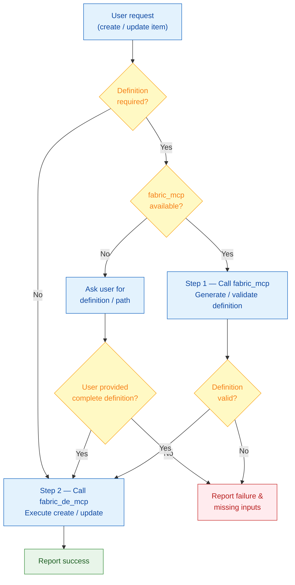

# Fabric-de-agent-new — Agent Documentation

> **Azure AI Foundry (New)** — Project `aifoundryhub9616386474-project`
> **Version:** 5 &nbsp;|&nbsp; **Model:** `gpt-5.3-codex` (v2026-02-24) &nbsp;|&nbsp; **Kind:** Prompt Agent
> **Region:** Sweden Central &nbsp;|&nbsp; **SKU:** S0 (GlobalStandard, 1 000 capacity units)

---

## Overview

**Fabric-de-agent-new** is a prompt-based Azure AI Foundry agent that automates
Microsoft Fabric Data Engineering workflows. It follows a strict
**"definition-first"** execution model: item definitions are always generated or
validated by the Fabric MCP server before any create/update call is made to the
Fabric DE MCP server.

The agent is deployed in the new Azure AI Foundry portal under the project
**aifoundryhub9616386474-project** (resource group `rg_ai`, subscription
`ME-MngEnvMCAP854253-vijiso-1`).

---

## Architecture



---

## Connected MCP Tool Servers

The agent connects to **two** MCP servers via Streamable-HTTP transport:

| Label | Purpose | Endpoint (Azure Container Apps) |
|---|---|---|
| **Fabric_de_mcp_server** | Execute Fabric REST operations (CRUD on workspaces, items, pipelines, lakehouses) | `https://<containerapp-fqdn>/mcp` |
| **fabric_mcp** | Generate, validate & refine Fabric item definitions using docs, APIs & schemas | `https://<containerapp-fqdn>/` |

### Tool Surface — Fabric DE MCP (`fabric_de_mcp`)

| # | Tool | Description |
|--:|------|-------------|
| 1 | `create_pipeline` | Create a DataPipeline with an inlined JSON definition |
| 2 | `create_lakehouse` | Create a Lakehouse item |
| 3 | `list_workspaces` | List all workspaces in the Fabric tenant |
| 4 | `create_item` | Create any supported Fabric item (Lakehouse, Notebook, SparkJobDefinition, DataPipeline, …) |
| 5 | `list_items` | List all items in a workspace (supports pagination) |
| 6 | `get_item` | Get item properties by workspace + item ID |
| 7 | `update_item` | Update item metadata (display name / description) |
| 8 | `get_item_definition` | Retrieve the full base64-encoded definition of an item |
| 9 | `update_item_definition` | Replace an item's definition with new JSON |
| 10 | `get_lakehouse` | Get Lakehouse properties |
| 11 | `list_lakehouse_tables` | List tables in a Lakehouse (supports pagination) |
| 12 | `run_pipeline_job_instance` | Trigger a Data Factory pipeline run |
| 13 | `get_pipeline_job_instance` | Get execution status for a pipeline run |

### Tool Surface — Fabric MCP (`fabric_mcp`)

Provides definition generation, validation, and Microsoft documentation search:

| # | Tool | Description |
|--:|------|-------------|
| 1 | `microsoft_docs_search` | Search official Microsoft Learn docs |
| 2 | `microsoft_docs_fetch` | Fetch full Microsoft docs page as markdown |
| 3 | `microsoft_code_sample_search` | Search for code samples from official docs |
| 4 | `publicapis_bestpractices_examples_get` | Get example API payloads for a Fabric workload |
| 5 | `publicapis_bestpractices_get` | Get best-practice guidance for a Fabric topic |
| 6 | `publicapis_bestpractices_itemdefinition_get` | Get JSON schema definitions for Fabric items |
| 7 | `publicapis_get` | Get OpenAPI/Swagger spec for a Fabric workload |
| 8 | `publicapis_list` | List all Fabric workloads with public API specs |
| 9 | `publicapis_platform_get` | Get platform-level Fabric API spec |

Additional Azure tools: `group_list`, `subscription_list`, AZD scaffolding tools
(`architecture_planning`, `azure_yaml_generation`, `discovery_analysis`,
`docker_generation`, `error_troubleshooting`, `iac_generation_rules`,
`infrastructure_generation`, `plan_init`, `project_validation`,
`validate_azure_yaml`).

---

## Execution Workflow (Definition-First)



**Key rules:**
1. **Definition-first is mandatory** — `fabric_mcp` must produce/validate a
   definition before any `create_pipeline`, `create_item`, or `update_item` call.
2. **Exception** — Skip `fabric_mcp` only if the user supplies a complete
   definition **and** explicitly says to proceed.
3. **Pipeline specifics** — Copy-activity definitions must include valid
   `linkedService` settings; sink must include a `Table` action.
4. **No guessing** — The agent never invents workspace IDs, JSON fields, or
   schema properties.

---

## Model Deployments (Foundry Hub)

| Deployment | Model | Version | SKU | Capacity |
|---|---|---|---|---|
| gpt-5.3-codex | gpt-5.3-codex | 2026-02-24 | GlobalStandard | 1 000 |
| gpt-5.3-chat | gpt-5.3-chat | 2026-03-03 | GlobalStandard | 1 000 |
| gpt-5-chat | gpt-5-chat | 2025-10-03 | GlobalStandard | 500 |
| gpt-4.1 | gpt-4.1 | 2025-04-14 | GlobalStandard | 500 |
| gpt-4o | gpt-4o | 2024-11-20 | GlobalStandard | 10 |

The agent uses **gpt-5.3-codex** (the highest-capacity code-optimised deployment).

---

## Infrastructure

| Component | Value |
|---|---|
| Foundry Hub | `aifoundryhub9616386474` |
| Project | `aifoundryhub9616386474-project` |
| Resource Group | `rg_ai` |
| Location | Sweden Central |
| Kind | AIServices (S0) |
| AI Foundry Endpoint | `https://<hub>.services.ai.azure.com/` |
| Auth | `DefaultAzureCredential` (Entra ID) |

---

## Local Development (DevUI)

The same agent logic is mirrored in the repo under `src/devui/fabric_de_agent/`.
DevUI connects to the MCP servers via `MCPStreamableHTTPTool` and reuses the
identical system instructions.

```
# Start MCP server locally
python -m fabric_de_mcp

# Start DevUI
devui ./src/devui --port 8080
```

Environment variables (in `src/devui/fabric_de_agent/.env`):

| Variable | Purpose |
|---|---|
| `FABRIC_DE_MCP_SERVER_URL` | Fabric DE MCP endpoint (default `http://127.0.0.1:8000/mcp`) |
| `FABRIC_MCP_URL` | Fabric MCP endpoint (definition server) |
| `AZURE_AI_PROJECT_ENDPOINT` | Foundry project endpoint for auth |
| `AZURE_AI_MODEL_DEPLOYMENT_NAME` | Model deployment to use |

---

## Security

- Bearer tokens are **never** committed or logged.
- Auth uses `DefaultAzureCredential` (Entra ID / managed identity).
- MCP tool wrappers accept an optional `token` override for testing.
- All endpoints use HTTPS in production; local dev uses `http://127.0.0.1`.
