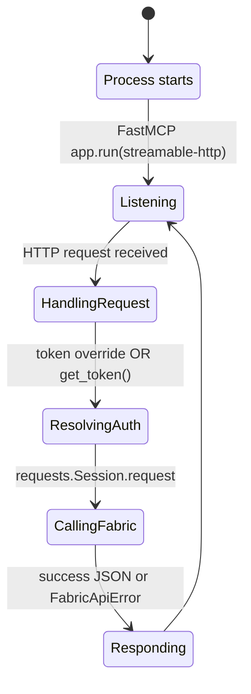
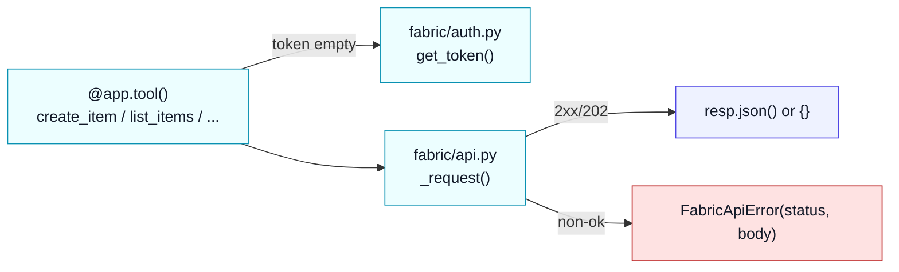

# MCP internals (tools + Fabric REST)

This document breaks down how the MCP server operates.

## MCP server state (conceptual)

The server is typically run in **Streamable HTTP** mode and serves the MCP endpoint at `/mcp`.

## Tool call flow (from code)

Tool functions live in `src/fabric_de_mcp/server.py` and follow this pattern:

- Accept arguments for operation (workspace/item ids, names, etc.)
- Accept optional `token` override
- If `token` is not provided, call `get_token()`
- Delegate to `fabric_de_mcp.fabric.api` for HTTP calls

## Fabric REST endpoints used

These map directly to functions in `src/fabric_de_mcp/fabric/api.py`:

- Workspaces
  - `GET /v1/workspaces`
- Items
  - `POST /v1/workspaces/{workspaceId}/items`
  - `GET /v1/workspaces/{workspaceId}/items`
  - `GET /v1/workspaces/{workspaceId}/items/{itemId}`
  - `PATCH /v1/workspaces/{workspaceId}/items/{itemId}`
  - `POST /v1/workspaces/{workspaceId}/items/{itemId}/getDefinition`
  - `POST /v1/workspaces/{workspaceId}/items/{itemId}/updateDefinition`
- Lakehouse
  - `GET /v1/workspaces/{workspaceId}/lakehouses/{lakehouseId}`
  - `GET /v1/workspaces/{workspaceId}/lakehouses/{lakehouseId}/tables`
- Pipeline jobs
  - `POST /v1/workspaces/{workspaceId}/items/{itemId}/jobs/instances?jobType=Pipeline`
  - `GET /v1/workspaces/{workspaceId}/items/{itemId}/jobs/instances/{jobInstanceId}`

## Retry behavior

HTTP retries are configured in `build_session(retries, backoff)` using `requests.adapters.Retry`:

- Retries on: `408, 409, 429, 500, 502, 503, 504`
- Methods: `HEAD, GET, OPTIONS, POST, PATCH`
