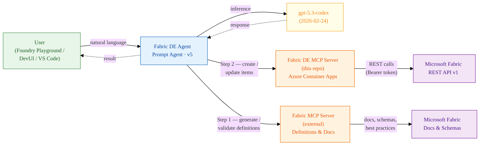
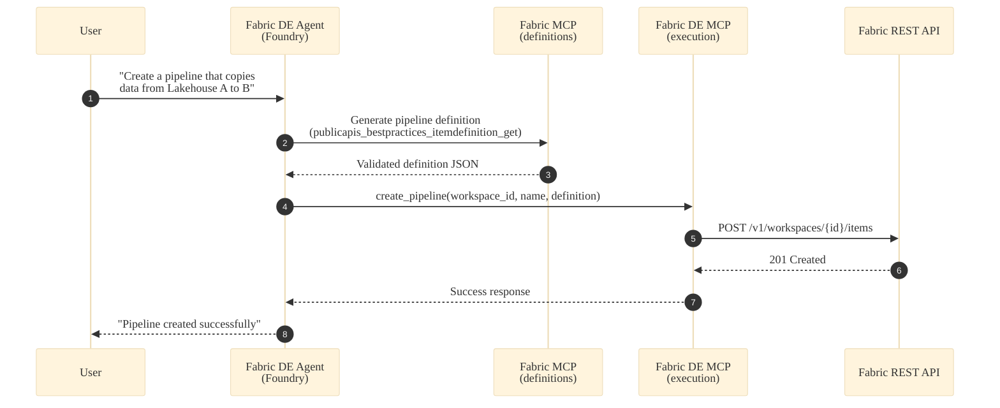
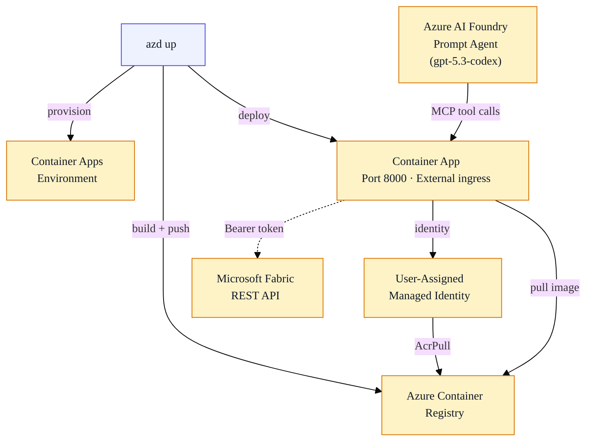

# Fabric Data Engineering Agent

## Introduction

A multi-agent system that automates Microsoft Fabric Data Engineering through natural language. An **Azure AI Foundry prompt agent** (powered by `gpt-5.3-codex`) delegates to **two specialized MCP tool servers** — one for generating and validating Fabric item definitions, and one for executing Fabric REST operations — following a strict **definition-first** workflow to create lakehouses, data pipelines, notebooks, and other Fabric items.

---

## Business Impact

Built for **Data Engineers**, **Platform Engineers**, and **Analytics teams** who need to automate Fabric workspace provisioning, pipeline creation, and lakehouse management without manually navigating the Fabric portal or writing raw REST API scripts.

- **Democratizes Fabric automation** by enabling users to create and manage data engineering resources through conversational AI
- **Reduces provisioning time** from manual portal clicks and custom scripts to single natural-language requests
- **Enforces best practices** through definition-first validation — pipeline definitions are always generated and validated against official Fabric schemas before execution, preventing malformed deployments
- **Lowers the barrier to entry** for teams adopting Microsoft Fabric by abstracting REST API complexity behind MCP tools

---

## Customer Success

Developed as an internal enabler to accelerate Microsoft Fabric Data Engineering adoption. The agent demonstrates end-to-end automation of complex multi-step workflows — from lakehouse creation to pipeline definition generation, deployment, and execution monitoring — all via natural language. Deployed on Azure AI Foundry with dual MCP server orchestration, and moving towards deeper integration with Fabric item types and cross-workspace operations.

---

## Architecture



The system comprises three specialized agents / servers:

1. **Fabric DE MCP Server** _(this repo)_ — executes Fabric REST operations: CRUD on workspaces, items, lakehouses, pipelines, and pipeline job runs
2. **Fabric MCP Server** _(external)_ — generates, validates, and refines Fabric item definitions using official Microsoft docs, API specs, and JSON schemas
3. **Foundry Prompt Agent** — orchestrates the two MCP servers, enforcing definition-first execution and translating natural-language requests into multi-step Fabric workflows

---

## Key Features

### Multi-Agent Orchestration with MCP

A Foundry prompt agent coordinates two MCP tool servers over Streamable HTTP transport. The agent enforces a definition-first workflow: definitions are generated/validated by Fabric MCP before any create/update call is made to Fabric DE MCP.

### Definition-First Execution

All item definitions (pipelines, notebooks, spark jobs) are validated against official Fabric schemas before execution. The agent never guesses workspace IDs, JSON fields, or schema properties — it always asks for missing inputs.

### 22+ MCP Tools

13 tools for Fabric REST operations (workspace, item, lakehouse, and pipeline CRUD + job execution) and 9+ tools for definition generation, docs search, and API spec retrieval.

### Natural Language → Fabric Operations

Complex multi-step data engineering workflows — "create a lakehouse, build a copy pipeline from source to sink, run it, and check status" — expressed as a single conversational request.

### Cloud-Native Deployment

One-command deployment via `azd up` — Dockerfile + Bicep IaC provisions Azure Container Registry, Container Apps, and User-Assigned Managed Identity with AcrPull RBAC.

### Conversational Testing — DevUI + Agent Framework

A built-in DevUI chat interface mirrors the Foundry agent locally for interactive testing, connecting to the MCP servers via `MCPStreamableHTTPTool`.

---

## Execution Workflow



---

## Tool Surface

### Fabric DE MCP Server — 13 tools

| # | Tool | Description |
|--:|------|-------------|
| 1 | `list_workspaces` | List all workspaces in the Fabric tenant |
| 2 | `create_item` | Create any Fabric item (Lakehouse, Notebook, SparkJobDefinition, DataPipeline, …) |
| 3 | `list_items` | List items in a workspace (paginated) |
| 4 | `get_item` | Get item properties by ID |
| 5 | `update_item` | Update item metadata (name / description) |
| 6 | `get_item_definition` | Retrieve base64-encoded item definition |
| 7 | `update_item_definition` | Replace an item's definition |
| 8 | `create_lakehouse` | Create a Lakehouse |
| 9 | `get_lakehouse` | Get Lakehouse properties |
| 10 | `list_lakehouse_tables` | List tables in a Lakehouse (paginated) |
| 11 | `create_pipeline` | Create a DataPipeline with inlined definition |
| 12 | `run_pipeline_job_instance` | Trigger a pipeline run |
| 13 | `get_pipeline_job_instance` | Get pipeline run status |

### Fabric MCP Server (external) — 9+ tools

| # | Tool | Description |
|--:|------|-------------|
| 1 | `microsoft_docs_search` | Search Microsoft Learn docs |
| 2 | `microsoft_docs_fetch` | Fetch full docs page as markdown |
| 3 | `microsoft_code_sample_search` | Search official code samples |
| 4 | `publicapis_bestpractices_examples_get` | Example API payloads |
| 5 | `publicapis_bestpractices_get` | Best-practice guidance |
| 6 | `publicapis_bestpractices_itemdefinition_get` | JSON schema definitions for Fabric items |
| 7 | `publicapis_get` | OpenAPI spec for a Fabric workload |
| 8 | `publicapis_list` | List all Fabric workloads with API specs |
| 9 | `publicapis_platform_get` | Platform-level Fabric API spec |

---

## Infrastructure



| Component | Detail |
|-----------|--------|
| **Agent Runtime** | Azure AI Foundry · Sweden Central · S0 (1 000 capacity units) |
| **Model** | gpt-5.3-codex (2026-02-24, GlobalStandard) |
| **MCP Server** | Azure Container Apps · Port 8000 · External ingress |
| **Auth** | `DefaultAzureCredential` (Entra ID / Managed Identity) |
| **IaC** | Bicep (`infra/main.bicep`) · `azd up` for one-command deploy |
| **Protocol** | MCP over Streamable HTTP (`/mcp` endpoint) |

---

## Getting Started

```bash
# 1. Install
python -m venv .venv && .\.venv\Scripts\Activate.ps1
pip install -e .

# 2. Configure
Copy-Item src/fabric_de_mcp/.env.example src/fabric_de_mcp/.env

# 3. Run MCP server
python -m fabric_de_mcp
# → http://127.0.0.1:8000/mcp

# 4. Deploy to Azure
az login && azd up
# → https://<CONTAINER_APP_FQDN>/mcp

# 5. Test with DevUI (optional)
pip install --pre -r src/devui/requirements.txt
Copy-Item src/devui/fabric_de_agent/.env.example src/devui/fabric_de_agent/.env
devui ./src/devui --port 8080
```

---

## Links

| Resource | Location |
|----------|----------|
| Architecture overview | [`docs/architecture.md`](architecture.md) |
| MCP internals | [`docs/mcp-internals.md`](mcp-internals.md) |
| Auth & authorization | [`docs/auth.md`](auth.md) |
| DevUI dataflow | [`docs/devui-dataflow.md`](devui-dataflow.md) |
| Foundry agent details | [`docs/fabric-de-agent-new.md`](fabric-de-agent-new.md) |
| Folder structure | [`docs/folder-structure.md`](folder-structure.md) |
